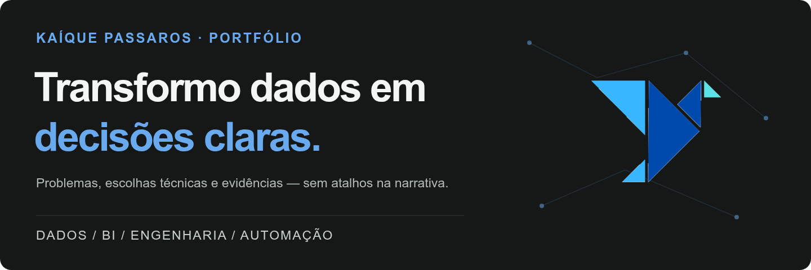
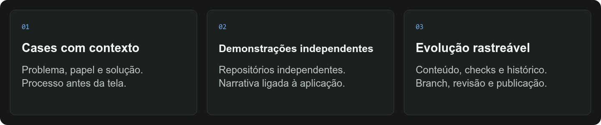
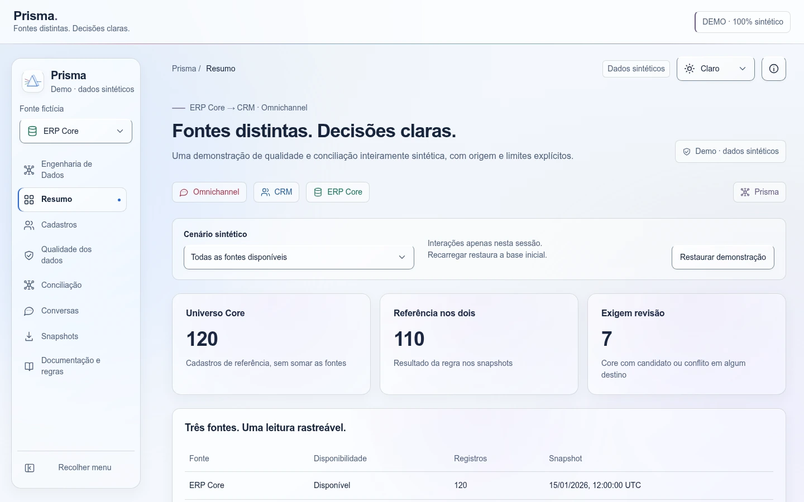
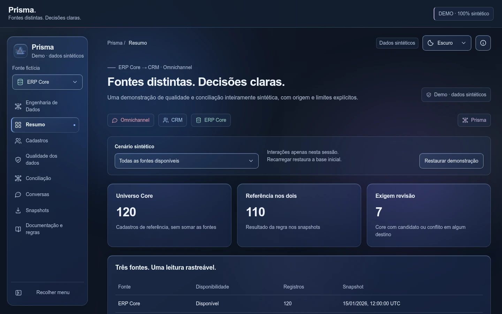
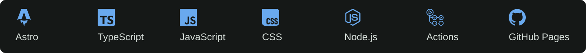

<p align="center">
  
</p>

<p align="center">
  
</p>

<p align="center">
  <a href="https://github.com/kpassaros/portfolio/actions/workflows/validate.yml"></a>
  <a href="https://github.com/kpassaros/portfolio/actions/workflows/deploy.yml"></a>
  
  
</p>

<p align="center">
  <a href="https://kpassaros.github.io/portfolio/">Explorar portfólio</a> ·
  <a href="https://kpassaros.github.io/portfolio/projects/">Ver projetos</a> ·
  <a href="https://kpassaros.github.io/portfolio/labs/">Conhecer os Labs</a> ·
  <a href="https://www.linkedin.com/in/kaiquepassaros/">LinkedIn</a>
</p>

## Um portfólio que explica o trabalho

Uma tela bonita mostra o resultado. Um case bem construído mostra **o problema, as escolhas e os limites da solução**.

Criei este portfólio para conectar essas duas leituras. Ele reúne minha trajetória em Dados, BI e Transformação Digital com projetos que permitem explorar o processo técnico — da fonte de dados à experiência de uso.

O site é estático; o conteúdo tem contrato e a publicação passa por um pipeline de validação. Cada aplicação demonstrada mantém seu próprio ciclo de desenvolvimento. O portfólio é a ponte, não uma cópia de todos os repositórios.

> **Este repositório é o código do portfólio.** Os cases documentam aplicações e estudos diferentes. Dados sintéticos, protótipos e resultados de execução são identificados em seu contexto; não são métricas de impacto do site.

<p align="center">
  
</p>

## Por que construí assim

Eu precisava de um lugar em que adicionar um projeto não significasse copiar uma página inteira — nem manter versões diferentes da mesma navegação, tema e experiência.

A arquitetura atual usa **Astro em modo estático**, Content Collections e layouts compartilhados. O case vive em Markdown com frontmatter validado; as imagens ficam em `public/`; as rotas são geradas no build. O visitante recebe HTML, CSS e JavaScript, sem precisar de um servidor Astro.

A trajetória anterior também permanece no repositório. Há conteúdo e arquivos legados que ainda precisam de curadoria. Preservá-los não significa tratá-los como uma segunda aplicação vigente.

## O que você encontra no site

- **Sobre e carreira:** contexto profissional, trajetória e forma de pensar.
- **Competências:** tecnologias relacionadas às aplicações em que fazem sentido.
- **Projetos:** catálogo pesquisável, filtros, narrativa técnica e acessos às demonstrações.
- **Labs:** espaço separado para hipóteses e protótipos, com limitações explícitas.
- **Experiência compartilhada:** temas claro/escuro, menu responsivo e background neural.
- **Contato:** links profissionais e formulário com integração Formspree.

A existência do código do formulário não comprova entrega de mensagens. O fluxo precisa de homologação com o serviço configurado; este repositório não armazena segredos de administração desse serviço.

## Cases e demonstrações

| Case | O que apresenta | Onde explorar |
| --- | --- | --- |
| **CashFlow Intelligence** | Consolidação financeira, tratamento, conciliação e dashboard DataStudio com demonstração sintética | [Case](https://kpassaros.github.io/portfolio/projects/cashflow-intelligence/) |
| **FutureViz Components** | Biblioteca de componentes e contratos para experiências de BI e web | [Case](https://kpassaros.github.io/portfolio/projects/futureviz-components/) · [Aplicação](https://kpassaros.github.io/futureviz-bi-components/index.html) |
| **Prisma Central** | Engenharia de dados, qualidade cadastral e conciliação explicável entre ERP Core, CRM e Omnichannel sintéticos | [Demo](https://kpassaros.github.io/prisma-central/) · [Código](https://github.com/kpassaros/prisma-central) |
| **FutureViz Lab** | Protótipo de investigação de uma experiência de construção de componentes — não uma capacidade validada de produção | [Lab](https://kpassaros.github.io/portfolio/labs/futureviz-lab/) |

**Inclusão preparada neste pacote:** o case do Prisma está em `src/content/projects/prisma-central.md`. Sua rota prevista é `/portfolio/projects/prisma-central/`, após PR, checks e deploy. A demo independente já foi confirmada pelo autor. Não confundir essa confirmação com a publicação do novo case no portfólio.

O Prisma entra no catálogo com `featured: false`, preservando os destaques atuais da Home. A promoção a destaque é uma decisão separada.

### Prisma Central — uma amostra do processo

O pipeline gera fontes fictícias, oferece uma API local somente leitura, extrai snapshots paginados e valida sua integridade antes da conciliação. O site público consulta os resultados já preparados: não executa uma API operacional ao vivo.

**Aurora — captura da demonstração sintética executada localmente:**



**Nocturne — a mesma demonstração, sem mudar regras ou dados:**



As imagens mostram a aplicação Prisma, não o layout do portfólio nem uma verificação do deploy remoto. Valores exibidos são exemplos sintéticos. Contato coincidente é candidato de correspondência, não identidade confirmada.

## Por dentro do portfólio

```text
Markdown + frontmatter             Assets e scripts públicos
src/content/projects/             public/projects/
src/content/labs/                 public/assets/ e public/scripts/
          │                                  │
          └───────────────┬──────────────────┘
                          ↓
             Content Collections + schema
                  src/content.config.ts
                          ↓
                Layouts e componentes
                     src/layouts/
                          ↓
                   Build estático
                         dist/
                          ↓
               GitHub Actions → Pages
```

### Fonte vigente

```text
portfolio/
├── .github/workflows/           # Validação em PR e deploy na main
├── public/                      # Tudo aqui é copiado para o site público
├── src/
│   ├── components/              # Navegação, rodapé e cards
│   ├── content/
│   │   ├── projects/            # Cases vigentes em Markdown
│   │   └── labs/                # Conteúdo experimental
│   ├── data/                   # Carreira e competências
│   ├── layouts/                # Estrutura compartilhada dos cases
│   ├── pages/                  # Rotas Astro
│   └── styles/                 # Identidade visual compartilhada
├── scripts/audit.mjs            # Auditoria mínima de conteúdo
├── docs/                        # Decisões, revisão e assets do README
├── astro.config.mjs
├── package.json
└── package-lock.json
```

As pastas antigas `content/`, `data/`, `assets/` e páginas HTML na raiz ainda existem, mas **não substituem `src/` e `public/`**. Algumas guardam artefatos que precisam ser preservados antes de qualquer exclusão. A auditoria indica os candidatos e os riscos.

## Tecnologias usadas no site

<p align="center">
  
</p>

| Camada | Uso neste repositório |
| --- | --- |
| **Astro** | Geração estática, rotas, layouts e Content Collections |
| **TypeScript + schema** | Contrato de conteúdo e verificação da aplicação |
| **Markdown, HTML e CSS** | Narrativa dos cases, estrutura e identidade visual |
| **JavaScript** | Temas, navegação, busca, filtros e interações no navegador |
| **Node.js 24 + npm** | Ambiente de desenvolvimento, auditoria e build |
| **GitHub Actions + Pages** | Validação de contribuições e publicação do artefato estático |

As tecnologias dos cases são independentes da stack do portfólio. Python e SQLite, por exemplo, pertencem ao Prisma Central; não são um backend deste site Astro.

## Executar localmente

**Pré-requisito:** Node.js 24.x e npm. As versões diretas e transitivas estão registradas no `package.json` e no `package-lock.json`.

```bash
git clone https://github.com/kpassaros/portfolio.git
cd portfolio
npm ci
npm run audit
npm run check
npm run build
npm run dev
```

Abra o endereço informado pelo Astro no terminal. Para inspecionar o build estático:

```bash
npm run preview
```

| Comando | Responsabilidade |
| --- | --- |
| `npm ci` | Instala as dependências do lockfile; exige acesso ao registro ou cache completo |
| `npm run audit` | Confere conteúdo e assets mínimos e bloqueia alguns textos provisórios |
| `npm run check` | Executa `astro check` |
| `npm run build` | Executa check e build estático, gerando `dist/` |
| `npm run dev` | Inicia o ambiente de desenvolvimento |
| `npm run preview` | Serve o artefato gerado para revisão local |

A auditoria mínima **não é** uma certificação de segurança, acessibilidade ou ausência de regressões. Testar links, navegação, formulários e recursos externos continua necessário.

## Adicionar um novo case

1. Criar `src/content/projects/seu-slug.md`, seguindo o schema vigente.
2. Colocar os assets em `public/projects/seu-slug/`.
3. Definir `publish` e `featured` conscientemente.
4. Descrever problema, papel, solução, entregas, limites e aprendizados.
5. Executar audit, check e build; revisar desktop, notebook e celular.
6. Publicar pelo fluxo de branch e PR, com rollback preservado.

Não copiar páginas HTML completas nem editar `dist/` manualmente.

[Guia atualizado de inclusão de projetos →](GUIA-ADICIONAR-PROJETO.md)

## Publicar com controle

```text
Versão estável / tag de rollback
             ↓
        Branch de trabalho
             ↓
        Pull Request
             ↓
     Audit + check + build
             ↓
    Revisão visual e aprovação
             ↓
       Merge na main
             ↓
     Artifact → GitHub Pages
             ↓
    Homologação e registro
```

- `validate.yml` valida PRs para `main` e pushes em `release/**`.
- `deploy.yml` constrói e publica pushes na `main`; também permite acionamento manual.
- Os workflows usam `npm ci` e Node 24.
- O prefixo do Pages é passado no build; links e assets precisam funcionar em `/portfolio/`.
- Mantenha a branch até a homologação final e reverta o PR se houver regressão.

**Validação desta preparação:** a auditoria mínima e as verificações locais de conteúdo/assets foram executadas. O build Astro local ficou bloqueado porque uma dependência não estava disponível no cache offline. O check, o build completo e os links externos devem ser confirmados no ambiente com dependências instaladas e no PR; este README não declara os checks remotos aprovados.

## Documentação, legado e limites

- [Guia de inclusão de projetos](GUIA-ADICIONAR-PROJETO.md) — fonte atual para adicionar cases Astro.
- [Auditoria do repositório e plano de limpeza](docs/audits/2026-10-06-prisma-readme-audit.md) — 24 READMEs da baseline, duplicações e riscos.
- [Checklist de homologação](VALIDATION.md) — roteiro a executar, não um atestado de aprovação.
- [Política de dados](POLITICA-DADOS-PORTFOLIO.md) — princípios vigentes; o trecho final ainda usa nomes de campos do contrato legado, conforme a auditoria.
- [Histórico de evolução](docs/EVOLUCAO-DO-PORTFOLIO.md) — decisões e entregas históricas, não inventário de funcionalidades atuais.

O pacote preserva arquivos antigos e não executa limpeza automática. Não aplicar instruções de pacotes históricos à aplicação vigente sem revisar os caminhos e o impacto.

**Segurança:** tudo em `public/` pode ser servido ao visitante. Não colocar ali segredos, bases reais, endpoints internos ou arquivos operacionais. `.gitignore` não remove dados que já tenham sido versionados; o histórico Git não está incluído no ZIP auditado.

**Serviços externos:** dashboards, formulário, badges e estatísticas têm disponibilidade e regras próprias. Um link configurado não comprova acesso atual. Os dados de demonstração de cada projeto devem ser identificados no respectivo case.

## Atividade deste repositório

<p align="center">
  <a href="https://github.com/kpassaros/portfolio/stargazers"></a>
  <a href="https://github.com/kpassaros/portfolio/forks"></a>
  
  <a href="https://github.com/kpassaros/portfolio/commits/main/"></a>
</p>

São métricas dinâmicas do **repositório `portfolio`**, não resultados de negócio. [Consulte código, linguagens e histórico diretamente no GitHub](https://github.com/kpassaros/portfolio).

## Autor e atividade do perfil

**Kaíque Passaros** — Dados, BI e Transformação Digital.

[Portfólio](https://kpassaros.github.io/portfolio/) · [GitHub](https://github.com/kpassaros) · [LinkedIn](https://www.linkedin.com/in/kaiquepassaros/)

Os cards abaixo representam o **perfil `kpassaros`**. Top languages considera os repositórios incluídos pelo serviço; streak e activity graph mostram contribuições do perfil. Nenhum deles mede exclusivamente este projeto ou comprova qualidade, testes ou impacto.

<p align="center">
  <a href="https://github.com/kpassaros"></a>
  <a href="https://github.com/kpassaros?tab=repositories"></a>
</p>

<p align="center">
  <a href="https://github.com/kpassaros"></a>
</p>

<p align="center">
  <a href="https://github.com/kpassaros"></a>
</p>

Badges e cards dependem de GitHub, Shields.io, GitHub Readme Stats, Streak Stats e Activity Graph. Seu carregamento não foi verificado no ambiente offline e pode sofrer limites ou indisponibilidade. Se um card falhar, use os links para o perfil e o repositório; os números não são simulados por imagens locais.

## Reutilização

Nenhuma licença foi adicionada por esta entrega. Disponibilidade pública não equivale a uma licença permissiva. Dependências e serviços mantêm suas próprias licenças e termos; para discutir reutilização do material autoral, entre em contato com o autor.
